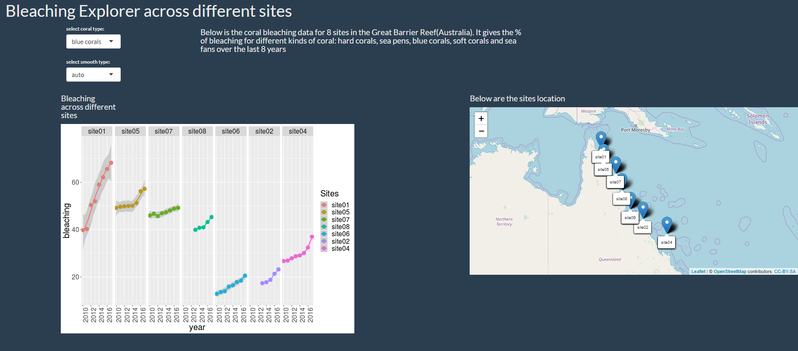

# great-barrier-reef-visualization

The project is about coral bleaching data for 8 sites in the Great Barrier Reef(Australia). It gives the % of bleaching for different kinds of coral: hard corals, sea pens, blue corals, soft corals and sea fans over the last 8 years.

* Alternatively, the app is published and can be accessed in below URL:
https://vpatil.shinyapps.io/coral_bleaching_great_barrier_reef

* To access the code and run the application locally, follow below steps:

    * The working directory needs to have the following files : 
        1. The 'bleaching-data.csv' file and
        2. R script (bleaching.R)
    * Having these files will ensure a smooth working of visualization and the shiny app.
    
    
* Methodolgy used:
   * Data is read and cleaned in R.
   * A shiny app is built to capture the visualization
      * First, a ggplot to capture the bleaching trend across different sites
      * Second, a leaflet map to represent the sites location on a map

* Preview of the app:

